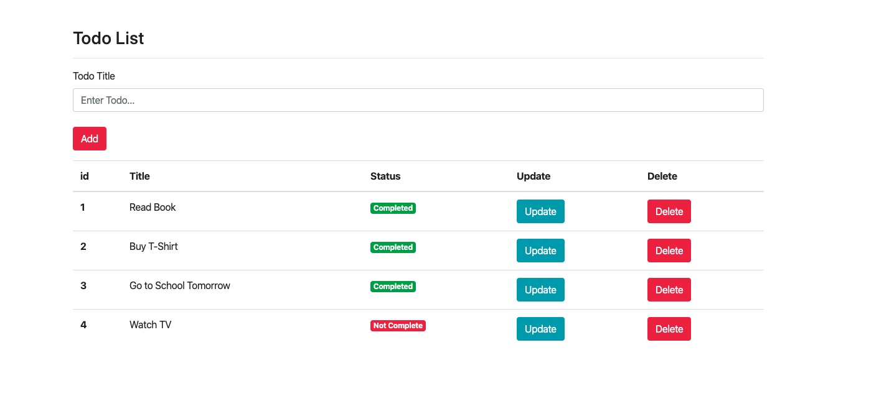

### Simple Flask Todo App

#### Setup

- Create python3 virtual environment and activate it (python3 -m venv venv)
- Run 'pip install -r requirements.txt' on terminal
- Run app.py on terminal for start local server

